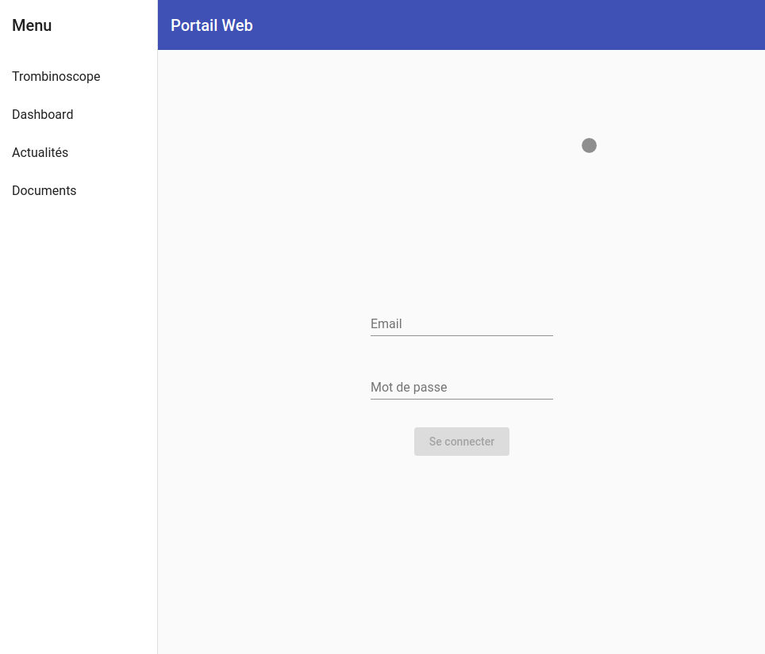
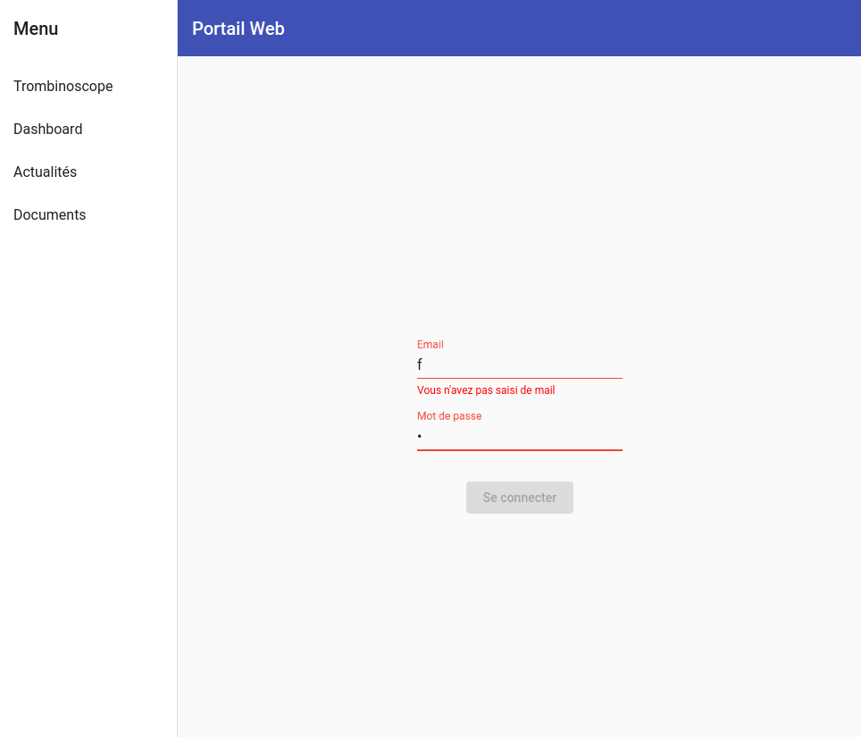

# **Portail Web**

<!-- **Rockpedia** -->

Arnaud Couderc et Alexandre Ludwig

11 mars 2019

---

# Présentation du portail

Ce portail web permet aux collaborateurs (administrateurs, emplyés, clients) de :
- se connaître par les cartes
- communiquer par email
- de consulter des actualités
- de partager des documents

---

# Écran de connection

L'écran de connection permet de se connecter avec son email et son mot de passe. Il détecte également si l'entrée nést pas bonne (adresse incorrecte, mot de passe pas assez long...)

---

---

# Process : Jenkins
À chaque modification sur *master* ou *develop*, Jenkins lance automatiquement un build de la branche modifiée.

---

# Surveillance : Spring Actuator

Par un appel à *${API_URL}/actuator*, on obtient cette page :

---

# Surveillance : Spring Boot Admin

- Ajouter des métriques de *actuator/metrics*

- Définir la priorité des loggers (DEBUG < FATAL)
