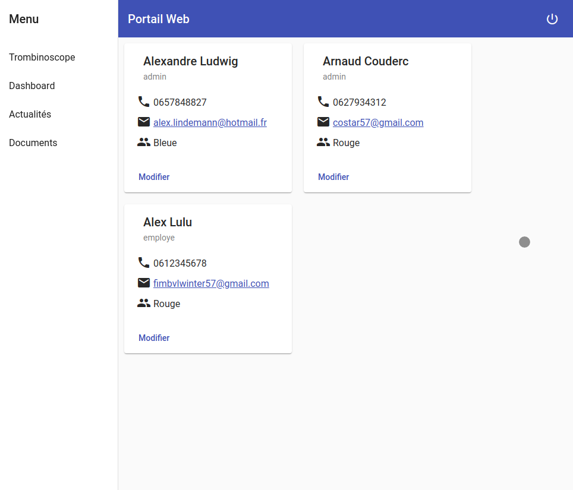
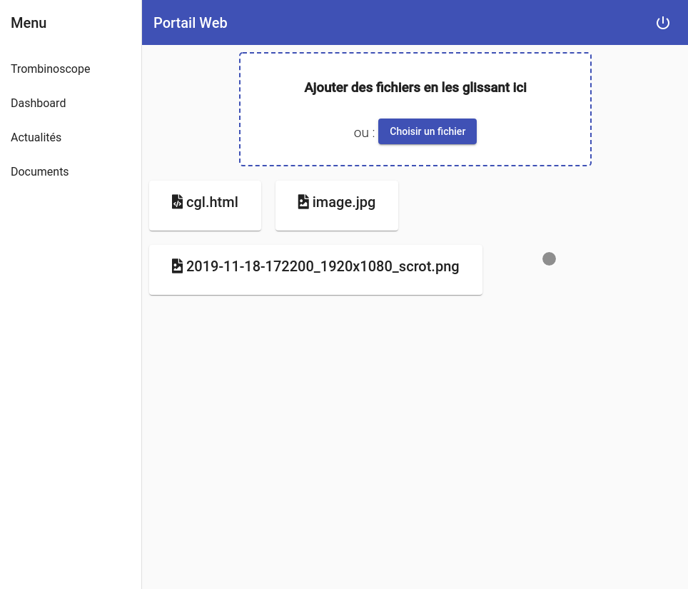

# **Portail Web**

<!-- **Rockpedia** -->

Arnaud Couderc et Alexandre Ludwig

11 mars 2019

---

# Présentation du portail

Ce portail web permet aux collaborateurs (administrateurs, employés, clients) de :
- se connaître par les cartes
- communiquer par email
- de consulter des actualités
- de partager des documents

---

# Écran de connection

L'écran de connection permet de se connecter avec son email et son mot de passe.

---

Les mauvaises entrées sont vérifiées (adresse incorrecte, mot de passe pas assez long...)

---

# Trombinoscope

Le trombinoscope permet de voir tous les collaborateurs, avec leur néuméro de téléphone et leur adresse mail et leur équipe.

---

Un employé peut modifier sa fiche et un administrateur peut modifier les fiches de tout le monde.

---

# Actualités

Les administrateurs peuvent écrire des actualités qui seront sauvegardées en HTML. Tout le monde peut voir ces actualités.

---

# Documents

Tout le monde peut enregistrer des documents, et même plusieurs à la fois avec un glissé-déposé.

